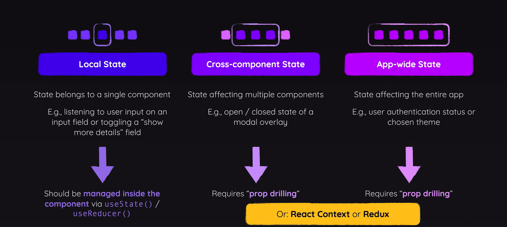
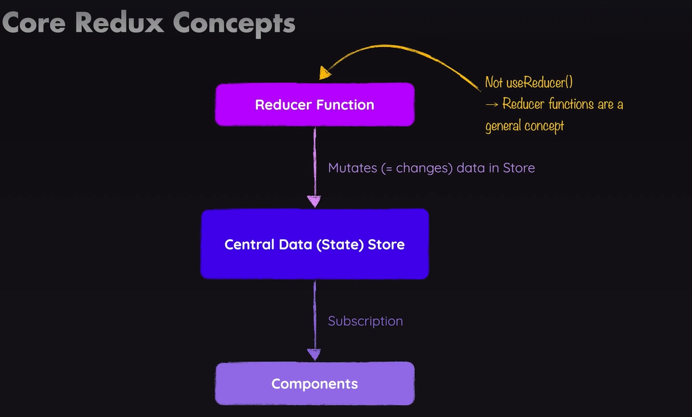
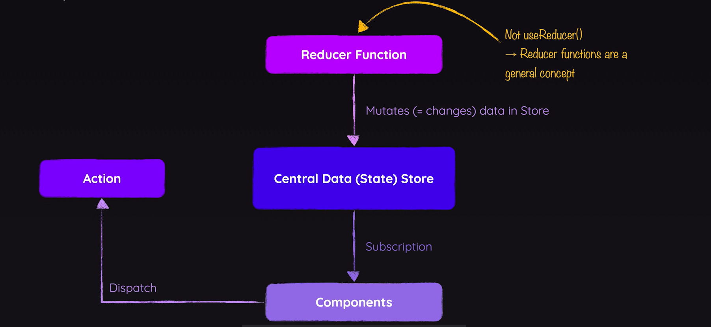
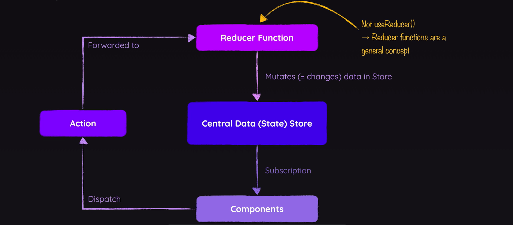
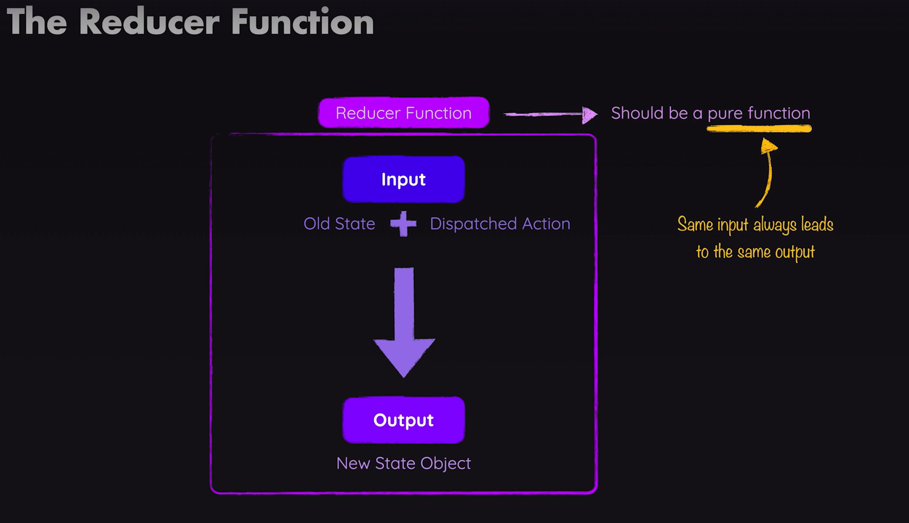

## STATE

### State in React Applications

We can split the definition of state into three main kinds of `STATE`.

- Local State
  - Is state so data which changes and affects the UI. Which Belongs to a single component.
- Cross-Component State
  - State affecting multiple components. e.g open/close state of a modal overlay. Requires `Prop Drilling`
- App-Wide State
  - State affecting the entire application. e.g User Authentication status or chosen theme. Requires `Prop Drilling`

### Redux vs React Context

#### Redux

Redux is a state management system for cross-component or app-wide state.

**Q. Don't we have React Context already?**
Ans: React Context is a concept and a feature we already used because it also allows us to avoid props chains and props drillings,and instead we can have a centeral place our `Context` and the `Context Provider Component` which we use for managing state.

**Q. Why do we need Redux?**

You can use bothe Context and Redux in the same application. Typically for application wide-state, you will only use one of the two, but then you could be using Redux for the general application wide-state and still use Context for selected multi-component states which are important in parts of your application. So mixing and matching like that would also be possible.

**Disadvantages that you could be facing with REACT CONTEXT**

1. Complex Setup & management
2. Performance

### How Redux Works?

Core Concept

- **One Central Data (STATE) Store**
- You never have more than one store
- It's one store for all your state for your entire application
- So in this store, you would store authetication state, theming, maybe something user input, whichever ctoss component or app-wide state you have, it goes into this one store.

Components don't directly manipulate that data in the store.
Instead if that, we use a concept called `reducer`. We have a reducer function.

**Reducer**
This reducer function which we have to set up. This function is responsible for mutating(Changing), So for changing the store data

- useReducer and the reducer function here is not that useReducer hook we learned about.
- **Reducer Functions** in general, are just a general concept.
- **Reducer Functions** are functions which takes some input, and then transform that input, they reduce it.
- For example they can reduce a list of numbers to the sum of that number and that's just one example.
- But they in general transform, inputs and spit out a new output a new result
  So that is a general programming concept, which `useReducer` hook uses and which this `Reducer Function Redux` will use also uses.
- So we have the `Reducer Function` which is reponsible for updating the store data.
- and we have components that subscribe to that data.

**All the above description is demonstrate in the image below.**

**Q. How do we connect components and that reducer function?, because ultimatily it will ofcourse be the components that should trigger a data change.**

- It is for example a click on a button in a component that should trigger some data change.

**Q So how do we connect that?**

- Trigger is a good word for that, because we have a third concept here.
- We have `ACTIONS` and components dispatch `ACTIONS`.
- We could say that components trigger, certain `ACTIONS`
- Now an `ACTIONS` is really just a simple JavaScript objectm, which describes the kind of operation, the reducer should perform.

- **All the above description is demonstrate in the image below.**
  

- Therefor, Redux then forwards **actions** to the **reducer**, reads that description of the desired operation and then this operation is performed by the reducer

  

- So components disptach **ACTIONS** which describe what should be done, but don't do it directly.
- Then these **ACTIONS** are forwarded to the **REDUCER** the **Reducer** then does what the action wants the reducer to do.
- and then the reducer spits out a new state, which effectively will replace the existing state in that **Central Data Store**.
- And when that happens, when that state in that data store is updated, subscribing components are notified.
- So that they can update their UI

**THAT'S HOW REDUX WORKS**

Reducer Function is a pure function and it takes 2 parameters.

1. State
2. Dispatached Action
3. It returns new state object

